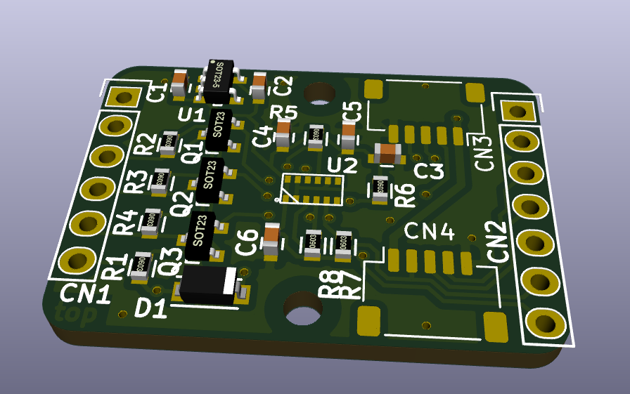
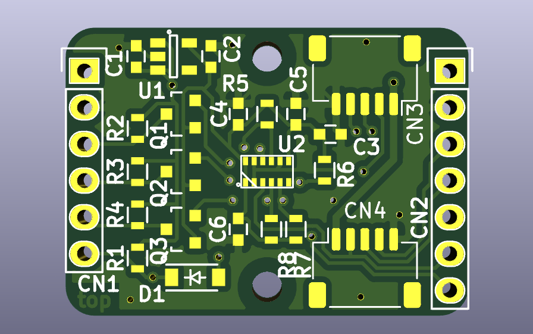

# TMF8801Breakout
Breakout board for the ams TMF8801 1D time-of-flight sensor

## Pinout

### CN1 and CN2

This is a regular 0.1-inch pin header.

| pin number | signal on CN1 | signal on CN2|
|:----------:|:-------------:|:------------:|
| 1          | VCC           | VCC          |
| 2          | GND           | GND          |
| 3          | I2C_SDA       | I2C_SDA      |
| 4          | I2C_SCL       | I2C_SCL      |
| 5          | INT           | INT          |
| 6          | ENABLE        | GPIO0        |
| 7          | not available | GPIO1        |

Several TMF8801Breakout boards can be used by connecting CN1 to CN2 of the previous board. GPIO0 is used to enabled the following TMF8801 and thus giving the possibility to change the I2C address of each device one after another.

### CN3 and CN4

This is Arduino ESLOV connector. JST SH 1mm 5-pin.

| pin number | signal on CN3 | signal on CN4|
|:----------:|:-------------:|:------------:|
| 1          | VCC           | VCC          |
| 2          | GND           | GND          |
| 3          | I2C_SDA       | I2C_SDA      |
| 4          | I2C_SCL       | I2C_SCL      |
| 5          | ENABLE        | GPIO0        |

Several TMF8801Breakout boards can be used by connecting CN3 to CN4 of the previous board. GPIO0 is used to enabled the following TMF8801 and thus giving the possibility to change the I2C address of each device one after another.

This connector does not allow the use of interrupts.

## PCB

### Top

### Bottom

## Resources

### Datasheets

 * https://ams.com/documents/20143/36005/TMF8801_DS000648_5-01.pdf

### Arduino Libraries

* [107-Arduino-TMF8801](https://github.com/107-systems/107-Arduino-TMF8801)
